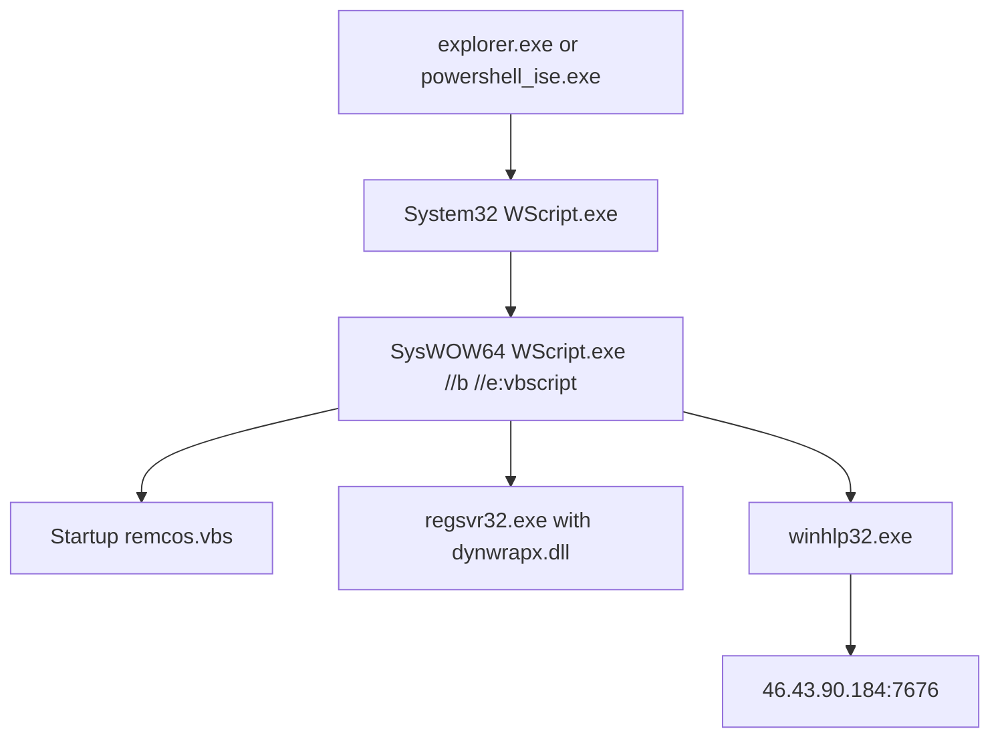

# Scenario 09: Endpoint Malware or EDR Alert Investigation

## Overview

This scenario reconstructs a confirmed malicious endpoint compromise from offline Microsoft Sysmon telemetry. The source dataset identifies the activity as Remcos-related. The investigation traces repeated Visual Basic Script execution, suspicious use of Windows Script Host and Regsvr32, creation of per-user Startup-folder persistence, and repeated outbound connections from `winhlp32.exe` assessed as command-and-control activity.

The source dataset is an attack-range simulation rather than a live enterprise incident. It does not contain a native EDR alert record, prevention action, case metadata, or analyst notes. The scenario therefore starts from a suspicious endpoint lead and validates the incident directly against the underlying Sysmon evidence.

## Investigation result

| Field | Result |
|---|---|
| Disposition | True Positive |
| Classification | Confirmed endpoint compromise; Remcos-related script-loader activity |
| Severity | High |
| Confidence | High |
| Affected host observed | `win-dc-469.attackrange.local` |
| Affected user observed | `ATTACKRANGE\Administrator` |
| Evidence window | 2021-09-29 18:56:29 UTC to 2021-10-01 23:40:20 UTC |
| Observed scope | One host and one user in the available dataset |

## Key findings

- Twenty-three executions of `remcos.vbs` were identified: ten from a Desktop directory and thirteen from `C:\Temp`.
- The top-level `System32\WScript.exe` processes were launched by `explorer.exe` ten times and by one long-running `powershell_ise.exe` process thirteen times.
- Each top-level script execution spawned `SysWOW64\wscript.exe` with `//b //e:vbscript`, producing a one-to-one chain of 23 parent and 23 child WScript processes.
- The script-loader chain used `regsvr32.exe /I /S` with `dynwrapx.dll` and launched `C:\Windows\winhlp32.exe`.
- Eleven distinct networked `winhlp32.exe` instances made fifteen connections to `46.43.90.184:7676`; the last observed connection occurred on 2021-10-01 at 23:39:10 UTC.
- The script created or refreshed `remcos.vbs` in the Administrator Startup folder 23 times. Twenty-two refresh cycles deleted the previous copy before recreating it.
- No process-creation record showed execution from the Startup copy. Persistence placement was confirmed, but successful logon-triggered activation was not observed.
- No evidence in the reviewed dataset confirmed lateral movement, credential theft, data exfiltration, or compromise of additional hosts.

## Confirmed execution chain

## Evidence summary

The raw file contained 13,935 well-formed Sysmon XML events, no exact duplicate events, and eleven observed Event IDs: `1`, `3`, `5`, `7`, `10`, `11`, `12`, `13`, `18`, `22`, and `23`.

The investigation relied primarily on:

- Event ID 1: process creation and parent-child relationships;
- Event ID 3: outbound network connections;
- Event ID 7: module loads supporting network-capable script behavior;
- Event IDs 11 and 23: Startup-file creation, deletion, and recreation;
- Event IDs 12 and 13: registry context.

Raw Sysmon data remains local and is excluded from Git. Only minimized summaries and analytical documents are intended for publication.

## Repository contents

| File | Purpose |
|---|---|
| `dataset-decision-record.md` | Dataset provenance, suitability, and limitations |
| `triage-note.md` | Initial assessment, severity, scope, and escalation decision |
| `investigation-report.md` | Full evidence-based investigation and conclusions |
| `endpoint-timeline.md` | Chronological reconstruction of material events |
| `process-tree-analysis.md` | Process ancestry, command lines, and execution counts |
| `iocs-and-scope.md` | Actionable indicators, contextual artifacts, and scope |
| `incident-classification-and-mitre-attack.md` | Incident classification and evidence-bounded ATT&CK mapping |
| `recommended-actions.md` | Containment, eradication, recovery, and hunting actions |
| `detection-opportunities.md` | Detection logic, correlation ideas, and tuning guidance |
| `evidence/processed/` | Minimized analytical evidence summaries derived from the raw telemetry |

## Skills demonstrated

- Endpoint alert validation using raw Sysmon telemetry
- Process-tree and command-line analysis
- Windows Script Host and LOLBin investigation
- File-persistence analysis
- Endpoint-to-network correlation
- IOC confidence and blockability assessment
- Evidence-bounded MITRE ATT&CK mapping
- Containment prioritization and telemetry-gap documentation

## Important limitations

- The dataset contains no native EDR alert object, detection name, prevention status, or response action.
- The initial delivery of the Desktop script was not captured.
- The method used to place the script in `C:\Temp` was not observed.
- The process that launched PowerShell ISE could not be established because its Event ID 1 record was unavailable.
- Process injection into `winhlp32.exe` was not confirmed by the reviewed evidence.
- TCP/443 events lacked application-layer request, payload, SNI, and certificate context.
- The dataset covers one host; environment-wide absence of related activity cannot be established.

## References

- [Splunk Attack Data repository](https://github.com/splunk/attack_data)
- [Splunk: Detecting Malware Script Loaders Using Remcos](https://www.splunk.com/en_us/blog/security/detecting-malware-script-loaders-using-remcos-threat-research-release-december-2021.html)
- [MITRE ATT&CK: Remcos (S0332)](https://attack.mitre.org/software/S0332/)
- [MITRE ATT&CK: Visual Basic (T1059.005)](https://attack.mitre.org/techniques/T1059/005/)
- [MITRE ATT&CK: Regsvr32 (T1218.010)](https://attack.mitre.org/techniques/T1218/010/)
- [MITRE ATT&CK: Registry Run Keys / Startup Folder (T1547.001)](https://attack.mitre.org/techniques/T1547/001/)
