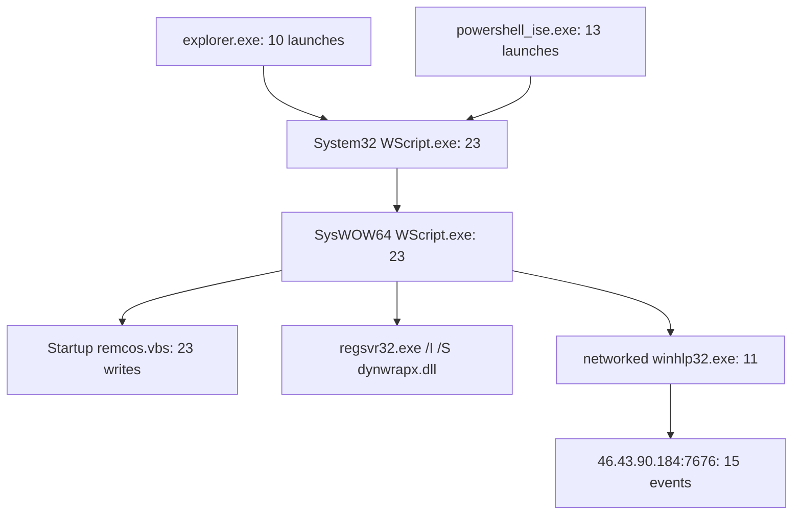

# Process-Tree Analysis

## Summary

The execution chain is consistent across 23 launches and links script execution, secondary process creation, persistence, and outbound communication.



## Stage 1: Top-level execution

### Desktop variant

```text
"C:\Windows\System32\WScript.exe"
"C:\Users\Administrator\Desktop\6104039597178880\remcos.vbs"
```

### Temp variant

```text
"C:\Windows\System32\WScript.exe" "C:\Temp\remcos.vbs"
```

Case variations such as `C:\temp` and `C:\Temp` were normalized as the same Windows path for counting.

## Stage 2: Silent 32-bit child

```text
"C:\Windows\SYSWOW64\WSCRIPT.EXE" //b //e:vbscript "<source>\remcos.vbs"
```

The child process was linked to the top-level WScript using the parent process GUID. Every one of the 23 source-script executions had one corresponding SysWOW64 child.

The child WScript hash was:

```text
MD5=6FA091DD757D5A64DC7B64F103198C10
SHA256=F451827D9D32C792C821EF0B89FEBF002D29004605B20CAACE53467EC01D2FAC
```

This is a Windows Script Host image hash and is contextual rather than a standalone malicious IOC. The malicious signal is the command line, ancestry, script path, file behavior, and network activity.

## Stage 3: Regsvr32 proxy execution

```text
Image:
C:\Windows\SysWOW64\regsvr32.exe

Command line:
"C:\Windows\System32\regsvr32.exe" /I /S
"C:\Users\ADMINI~1\AppData\Local\Temp\2\dynwrapx.dll"
```

The parent was `SysWOW64\wscript.exe`. Silent installation of a DLL from a temporary user path is high-signal in this ancestry and supports MITRE ATT&CK T1218.010.

The Regsvr32 image hash was:

```text
MD5=56CF190F4143DC68800C4125D6001B07
SHA256=F72ED4D11C9971A9B7CE0A5681EE35968A6B4CCDC2F2B3A9F3E81418605FA467
```

This is a contextual system-binary hash and should not be blocklisted by itself.

## Stage 4: `winhlp32.exe`

```text
Image: C:\Windows\winhlp32.exe
Command line: "C:\Windows\winhlp32.exe"
Parent: C:\Windows\SysWOW64\wscript.exe
```

Eleven distinct networked instances used the same hash and collectively generated fifteen outbound connection events to the endpoint assessed as C2.

```text
MD5=9328E170E5407D9DDE7EB1E208A2CBB4
SHA256=B32AD4D55CD16563908C3AD06B38020FDC9679FBF1BF8EDFFE747EE4122AF62E
```

The combination of WScript parentage and outbound TCP/7676 is high-confidence malicious context. The available evidence does not establish whether `winhlp32.exe` was injected, replaced, or otherwise abused.

## Parent-source matrix

| Top-level parent | Desktop VBS | Temp VBS | Total |
|---|---:|---:|---:|
| `explorer.exe` | 9 | 1 | 10 |
| `powershell_ise.exe` | 1 | 12 | 13 |
| Total | 10 | 13 | 23 |

## PowerShell ISE parent analysis

All thirteen PowerShell ISE-parented executions referenced:

```text
ProcessGuid: {8B6011A9-B0F1-6155-7237-02000000F001}
ProcessId: 1252
Image: C:\Windows\System32\WindowsPowerShell\v1.0\powershell_ise.exe
```

The parent identity is confirmed from child Event ID 1 records. The reviewed dataset did not include a corresponding Event ID 1 in which this GUID appeared as the created process. As a result:

- PowerShell ISE's role as direct parent is confirmed;
- its own creator and start time are not confirmed; and
- the repeated child launches must not be attributed to a scheduled task, service, or specific human action without additional evidence.

## Persistence relationship

Each SysWOW64 WScript process created or refreshed the same per-user Startup file. No process creation later referenced that Startup path.

The correct conclusion is:

> The process chain established or refreshed Startup-folder persistence 23 times. Logon-triggered execution of the persisted copy was not observed in the available telemetry.

## Process-tree conclusions

1. The process chain is confirmed by GUID-based ancestry rather than image names alone.
2. Repetition across 23 executions establishes a consistent loader workflow.
3. Regsvr32 and `winhlp32.exe` are suspicious because of ancestry, parameters, paths, and network behavior, not because Windows binaries are inherently malicious.
4. Explorer parentage does not prove a double-click.
5. PowerShell ISE parentage does not reveal who or what started PowerShell ISE.
6. Process injection remains unconfirmed.
