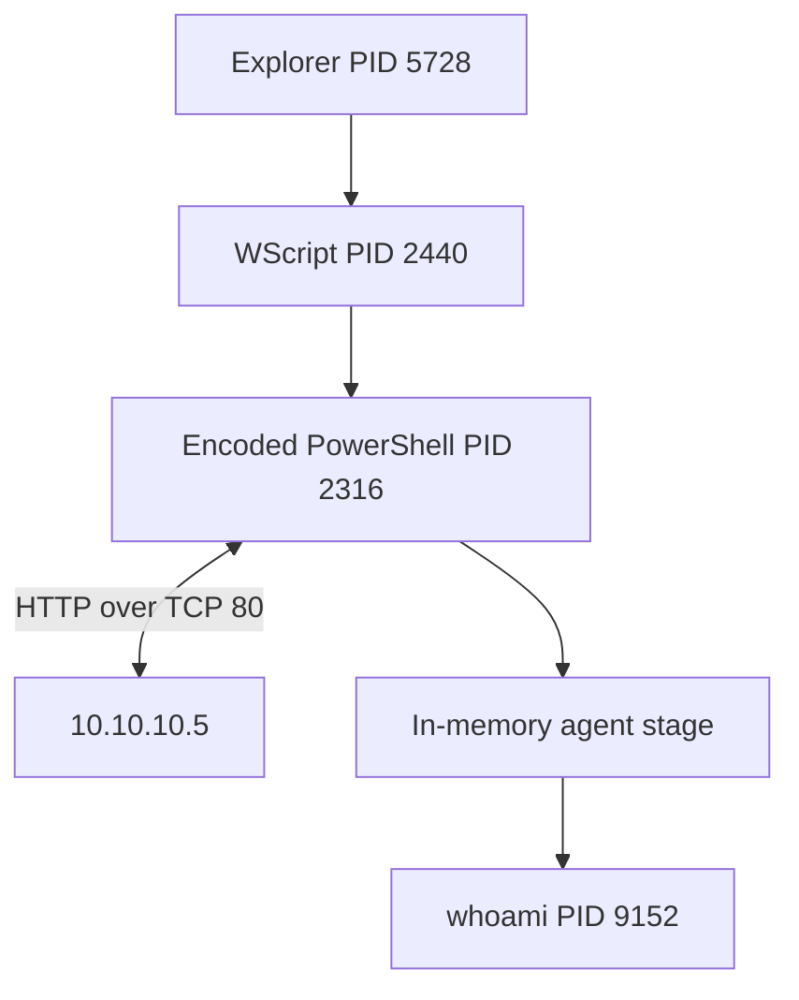

# Scenario 10 - Suspicious PowerShell Execution Investigation

## Scenario overview

This investigation examines a short window of Windows endpoint telemetry containing a VBS-launched, hidden, Base64-encoded PowerShell process. The objective was to determine whether the activity was authorised administration, suspicious but unconfirmed execution, or successful malicious activity without assuming that an encoded command or an upstream label proved compromise.

The evidence supports a **True Positive - successful malicious PowerShell / Empire-compatible agent execution** on one controlled-lab workstation.

| Assessment item | Result |
| --- | --- |
| Classification | True Positive |
| Severity | High |
| Confidence | High |
| Affected host | `WORKSTATION5.theshire.local` |
| Affected account | `THESHIRE\pgustavo` |
| Confirmed execution chain | `explorer.exe -> wscript.exe -> powershell.exe -> whoami.exe` |
| Confirmed impact | In-memory stage execution, HTTP command-and-control activity, local discovery, and agent task execution |
| Not observed | Persistence, privilege escalation, credential access, lateral movement, destructive action, or encryption |

The dataset was generated in a controlled Mordor/OTRF adversary-emulation lab. This classification describes the behaviour present in the telemetry; it is not a claim that a real organisation was compromised.

## Key findings

1. `explorer.exe` PID `5728` launched `wscript.exe` PID `2440` with `C:\Users\pgustavo\Desktop\launcher.vbs`.
2. WScript launched PowerShell PID `2316` with `-noP -sta -w 1 -enc` and a 5,056-character Base64 command.
3. PowerShell 4104 showed code that attempted to disable Script Block Logging and impair AMSI, decoded a server address, downloaded `/news.php`, decrypted the response, and passed it to `IEX`.
4. Sysmon Event 3 and Security Event 5156 independently recorded PowerShell connecting from `172.18.39.5:50699` to `10.10.10.5:80/TCP`.
5. A second-stage negotiation and agent loop appeared in the same PowerShell `HostId` and `RunspaceId`. It contained Empire-compatible POST paths, encrypted-session logic, discovery routines, and task processing.
6. The agent executed `whoami`; Sysmon and Security logs recorded the child process, and PowerShell 4103 recorded the result `theshire\pgustavo`.
7. No evidence showed persistence, elevated execution, credential dumping, remote WMI, or lateral movement in the approximately 69-second collection window.

## Evidence flow

The chain is not based on timing alone. Sysmon `ProcessGuid` and `ParentProcessGuid`, Security 4688 decimal/hexadecimal PID equivalence, the shared `LogonId`, and PowerShell `HostId`/`RunspaceId` jointly establish the relationships.

## PowerShell parameter interpretation

| Parameter | Meaning | Investigative significance |
| --- | --- | --- |
| `-noP` | Do not load the PowerShell profile | Reduces user-profile side effects and is common in scripted launchers |
| `-sta` | Use single-threaded apartment mode | Supports components requiring STA; not malicious by itself |
| `-w 1` | Window style value 1, used here to hide the window | Conceals the console from the interactive user |
| `-enc` | Decode the following UTF-16LE Base64 as a command | Provides obfuscation and requires content inspection |

No individual parameter proves maliciousness. The classification depends on the decoded behaviour, correlated network event, appearance of the second stage, and confirmed task execution.

## Evidence status

| Status | Findings |
| --- | --- |
| **Confirmed** | VBS launch; hidden encoded PowerShell; logging/AMSI impairment attempts; HTTP connection; downloaded stage execution; local WMI discovery; task loop; `whoami` execution and result |
| **Inferred** | The user probably opened the VBS through the interactive Explorer session; the `whoami` task and result were probably transported through the same C2 session |
| **Not observed** | Persistence, privilege escalation, credential access, lateral movement, additional on-disk payload, destructive action, or encryption |
| **Not available** | `launcher.vbs` bytes/hash, HTTP bodies, PCAP, proxy/server logs, memory capture, Defender/AMSI outcome logs, and post-capture activity |
| **Unable to confirm** | Whether AMSI impairment succeeded, the exact HTTP request/response contents, and the account's actual Administrators-group membership |
| **Detection gap** | Only one 4104 event; no Defender Operational, proxy, full DNS, or packet telemetry; short capture window |

## Repository contents

| File | Purpose |
| --- | --- |
| `triage-note.md` | Initial alert disposition and escalation decision |
| `investigation-report.md` | Full evidence analysis, correlation logic, scope, impact, and conclusion |
| `powershell-timeline.md` | UTC timeline and source timestamp handling |
| `process-tree.md` | Process chain, identifiers, and WMI relationship |
| `iocs.md` | Contextual indicators and incident-scoped identifiers |
| `detection-opportunities.md` | Detection logic, data requirements, and tuning guidance |
| `mitre-attack-mapping.md` | Evidence-based ATT&CK mapping and excluded techniques |
| `recommended-actions.md` | Containment, eradication, recovery, and monitoring actions |
| `dataset-decision-record.md` | Dataset provenance, licence decision, safety, coverage, and limits |
| `evidence-inventory.md` | Raw and processed evidence catalogue |
| `evidence/processed/` | Sanitised CSVs and filtered log extracts safe for publication |

## Data handling

Raw ZIP, JSONL, and upstream metadata are retained locally under `evidence/raw/` and excluded by `.gitignore`. The public evidence contains only aggregate counts, analyst-derived summaries, defanged indicators, and minimal log excerpts. Complete Base64 commands, complete scripts, keys, cookies, and downloaded bytes are not published.

## Primary data sources

- Windows Security Event ID 4688 and 5156
- PowerShell Operational Event ID 4103 and 4104
- Windows PowerShell Event ID 800
- Sysmon Event ID 1, 3, 11, 12, 22, and 23
- WMI Activity supporting telemetry

## Final conclusion

The evidence confirms successful malicious execution rather than a merely suspicious command. The initial stager's intended download-and-execute path was followed by new, second-stage code in the same PowerShell session, a process-attributed network connection, and a completed operating-system command task. Severity is High because arbitrary task execution and active C2 were established. Confidence is High because independent Windows Security, Sysmon, and PowerShell sources agree on the process, account, session, command, network destination, and follow-on result.

Impact is constrained to what was observed. The evidence does not support claims of persistence, privilege escalation, credential theft, lateral movement, or destructive activity.

## References

- [OTRF Security Datasets - Empire VBS Execution](https://securitydatasets.com/notebooks/atomic/windows/execution/SDWIN-190518182022.html)
- [MITRE ATT&CK - PowerShell](https://attack.mitre.org/techniques/T1059/001/)
- [MITRE ATT&CK - Visual Basic](https://attack.mitre.org/techniques/T1059/005/)
