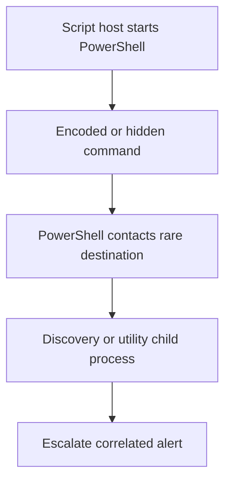

# Detection Opportunities

## Detection strategy

The strongest detection is a sequence, not a single string:



Each additional linked stage increases confidence. Use host, user, Logon ID, ProcessGuid/ParentProcessGuid, PID, and a short time window rather than timing alone.

## Recommended analytics

| ID | Analytic | Minimum data | High-signal conditions | Tuning guidance |
| --- | --- | --- | --- | --- |
| D01 | Script host launches PowerShell | Sysmon 1 or Security 4688 | Parent ends in `wscript.exe`/`cscript.exe`; child is PowerShell | Allow-list signed, approved login or management scripts by path, signer, owner, and deployment system |
| D02 | Encoded hidden PowerShell | 4688/Sysmon 1 command line | `-enc` or `-encodedcommand` plus `-nop`/hidden-window flag or unusual parent | Do not alert on `-enc` alone; normalise aliases and whitespace |
| D03 | PowerShell defence impairment | 4104, AMSI, or EDR content | `cachedGroupPolicySettings`, constructed `ScriptBlockLogging`, `AmsiUtils`, `amsiInitFailed`, reflection `SetValue` | Match token combinations and deobfuscated content rather than one exact string |
| D04 | PowerShell download-to-execute | 4104/4103 | `DownloadData`/`DownloadString` plus decode/decrypt and `IEX` | Exclude only known signed automation; retain source/destination context |
| D05 | PowerShell network to uncommon endpoint | Sysmon 3, EDR, proxy | PowerShell contacts rare/new IP or cleartext HTTP, especially after encoded launch | Baseline approved repositories and management systems; score internet and lateral destinations separately |
| D06 | PowerShell stage protocol features | 4103/4104/proxy | `/login/process.php`, `/news.php`, `UploadData`, cryptographic routines, task URI list | URI names are generic; require process or script context |
| D07 | PowerShell child discovery utility | Sysmon 1/4688 | PowerShell launches `whoami.exe`, `ipconfig.exe`, `systeminfo.exe`, or similar after network contact | Routine administration can trigger these; correlate with D01-D05 |
| D08 | Local WMI discovery from suspicious PowerShell | 4103 plus WMI Activity | `Get-WmiObject` for OS or network classes in suspicious runspace | Distinguish local inventory from remote WMI execution |
| D09 | PowerShell logging health degradation | Log configuration, 4104 volume, EDR | Logging-policy manipulation or abrupt loss of 4104 after suspicious stager | Monitor central log volume and configuration state; do not assume missing logs prove bypass |
| D10 | Correlated staged-agent sequence | Multi-source SIEM correlation | D01/D02 followed by D05 and D07 on same ProcessGuid/user/host within minutes | Highest-priority alert; preserve intermediate joins in the alert payload |

## Example correlation logic

The following is platform-neutral logic, not production-ready query syntax:

```text
stage_1 = process_create
          where parent_image in (wscript.exe, cscript.exe)
          and image is powershell.exe
          and command_line contains encoded-command alias

stage_2 = network_connection
          where process_guid == stage_1.process_guid
          and destination is rare or unauthorised

stage_3 = child_process
          where parent_process_guid == stage_1.process_guid
          and image in (whoami.exe, ipconfig.exe, systeminfo.exe, net.exe)

alert when stage_1 followed by stage_2 followed by stage_3
on the same host and account within five minutes
```

Include the parent command, decoded-command summary, ProcessGuid, Logon ID, destination, ScriptBlockId, HostId/RunspaceId, and child process in the analyst-facing alert.

## PowerShell content-normalisation requirements

Detection should account for:

- short and long parameter aliases (`-enc`, `-encodedcommand`, mixed case);
- irregular whitespace and quote placement;
- UTF-16LE Base64 decoding performed safely as text;
- string concatenation such as `'Amsi'+'Utils'`;
- mixed-case function and cmdlet names;
- reflection calls that avoid simple cmdlet signatures;
- equivalent download APIs such as `WebClient`, `Invoke-WebRequest`, and .NET `HttpClient`;
- in-memory execution through `IEX`, script blocks, reflection, or loaded assemblies.

Never execute decoded content during enrichment.

## Telemetry improvements

| Gap in this dataset | Recommended improvement |
| --- | --- |
| One 4104 record only | Protect and centralise Script Block Logging; monitor expected volume by host |
| No Defender/AMSI outcome | Ingest Microsoft Defender Operational and EDR prevention telemetry |
| No HTTP body | Collect proxy or network metadata with host/user/process attribution; retain PCAP only where policy permits |
| Limited DNS | Collect DNS client and resolver telemetry; note that IP-literal C2 will bypass DNS dependency |
| Short capture window | Retain endpoint and identity telemetry long enough to evaluate persistence and lateral movement |
| No original VBS | Quarantine and preserve script content/hash through EDR or forensic collection |
| No business context | Link alerts with asset owner, approved software, change tickets, and automation allow-lists |

## False-positive controls

- Require multiple related features for high severity.
- Use publisher/signature, script path, source repository, deployment account, destination reputation, and change context.
- Avoid permanent allow-listing based only on a filename or parent process.
- Treat private IPs and common URI paths as environment-specific, not universal indicators.
- Separate local WMI inventory from remote WMI execution.
- Do not classify routine PowerShell policy-test files as payloads or cleanup.

## Validation tests

Test each analytic with inert administrative simulations that generate process and logging events without downloading or executing live payloads. Verify that:

1. parent/child and ProcessGuid joins survive ingestion;
2. hexadecimal Security PIDs are normalised correctly;
3. Base64 is decoded as text in an isolated enrichment function;
4. alerts retain original and normalised timestamps;
5. allow-list decisions remain auditable; and
6. the multi-stage correlation produces a higher severity than any single weak feature.
