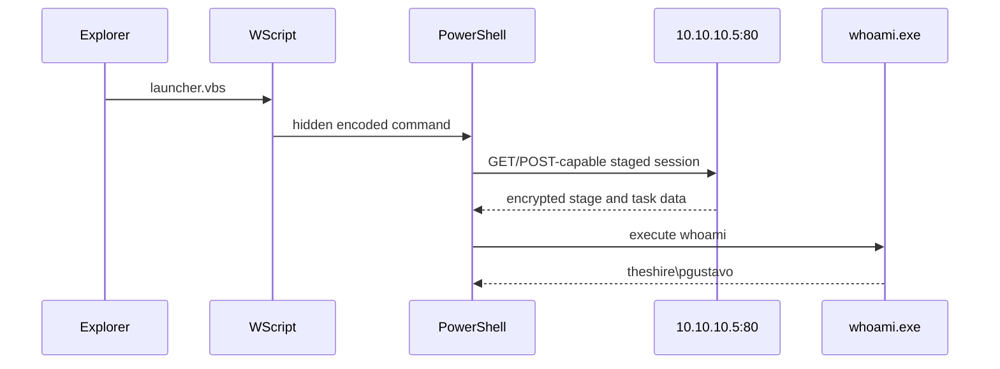

# PowerShell Investigation Timeline

## Time handling

All times below are normalised to UTC. For Sysmon, embedded `UtcTime` is preferred because it records the source event time. For PowerShell and Security records without an embedded UTC field, the dataset's normalised `@timestamp` is used. `EventTime` is unzoned local lab time and is not directly compared with UTC without conversion.

Collection and indexing delays explain why a PowerShell pipeline record can appear approximately one second after the child process it describes. `RecordNumber` orders records only inside its own Windows event channel and must not be compared numerically across channels.

## Timeline

| UTC time | Evidence | Event | Status |
| --- | --- | --- | --- |
| 20:09:55.035 | Sysmon 1, Record `251079`; Security 4688, Record `66940` | Explorer launched WScript with `launcher.vbs` | Confirmed |
| 20:09:55.760 | Sysmon 1, Record `251258`; Security 4688, Record `66981` | WScript launched hidden encoded PowerShell PID `2316` | Confirmed |
| 20:09:58.627 | Sysmon 11, Records `251530` and `251531` | PowerShell created two `__PSScriptPolicyTest` files | Confirmed benign runtime side effect |
| 20:09:58.846-20:09:58.877 | Sysmon 23, Records `251566` and `251567` | PowerShell deleted the two policy-test files | Confirmed benign cleanup |
| 20:09:59.621 | Sysmon 3, Record `251809`; Security 5156, Record `67323` | PowerShell connected to `10.10.10.5:80/TCP` | Confirmed |
| 20:10:00.327 | PowerShell 4104, Record `1948` | Initial stager logged: impairment attempts, download, decode, and `IEX` | Confirmed code; bypass result unable to confirm |
| 20:10:01.604 | Windows PowerShell 800, Record `1364` | New negotiation and agent-stage code appeared in the same HostId/RunspaceId | Confirmed downloaded stage execution |
| 20:10:02.693 | PowerShell 4103, Record `1962` | `Get-WmiObject Win32_NetworkAdapterConfiguration` | Confirmed local discovery |
| 20:10:02.694 | PowerShell 4103, Record `1963` | `Get-WmiObject Win32_OperatingSystem` | Confirmed local discovery |
| 20:10:22.845 | Sysmon 1, Record `251944`; Security 4688, Record `67369` | PowerShell launched `whoami.exe` PID `9152` | Confirmed task execution |
| 20:10:23.910 | Windows PowerShell 800, Record `1417` | `Invoke-Expression` parameter value was `whoami` | Confirmed |
| 20:10:23.918 | PowerShell 4103, Record `1999` | Output was `theshire\pgustavo`; command completion logged | Confirmed |
| 20:10:49.124 | Windows PowerShell 800, Record `1463` | Agent task-URI selection still active at capture end | Confirmed within capture |

## Information flow

The HTTP method and path logic are visible in PowerShell logs, but the actual packet payload is unavailable. The diagram therefore represents the confirmed program flow and high-confidence task-session inference, not reconstructed packet contents.

## Key timing observations

- The WScript-to-PowerShell transition occurred within `0.725` seconds by Sysmon source time.
- The PowerShell network connection occurred `3.861` seconds after PowerShell creation.
- The `whoami` child process occurred `27.085` seconds after PowerShell creation.
- No Sysmon Event 5 shows PowerShell terminating before the capture ended.
- The full dataset spans approximately `68.279` seconds, so delayed persistence or later impact cannot be excluded outside the window.

The publishable event-level timeline is also available as `evidence/processed/key-event-timeline.csv`.
