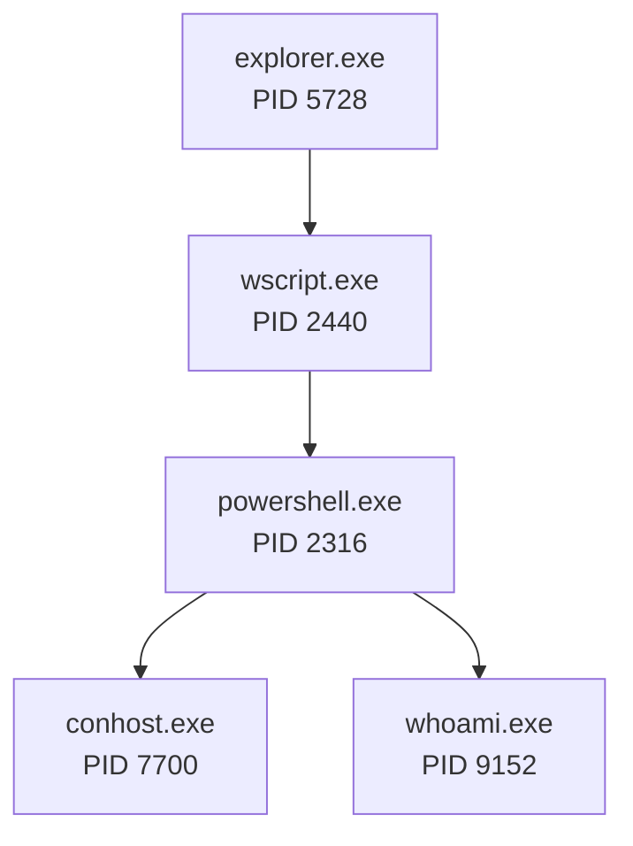

# Process Tree and Correlation Map

## Confirmed process tree

GitHub's Mermaid renderer may not show every identifier in the diagram; the complete values are listed below.

## Process identifiers

| Image | PID decimal / hex | ProcessGuid | Parent | User / Logon ID | Evidence |
| --- | --- | --- | --- | --- | --- |
| `explorer.exe` | `5728` / `0x1660` | `{860ba2e3-993f-5f52-8402-000000000400}` | Not captured in window | `THESHIRE\pgustavo` / `0x2D5A4B` | Parent fields in WScript Sysmon 1 and Security 4688 |
| `wscript.exe` | `2440` / `0x988` | `{860ba2e3-9f13-5f52-2603-000000000400}` | Explorer PID `5728` | `THESHIRE\pgustavo` / `0x2D5A4B` | Sysmon `251079`, Security `66940` |
| `powershell.exe` | `2316` / `0x90c` | `{860ba2e3-9f13-5f52-2703-000000000400}` | WScript PID `2440` | `THESHIRE\pgustavo` / `0x2D5A4B` | Sysmon `251258`, Security `66981` |
| `conhost.exe` | `7700` / `0x1e14` | `{860ba2e3-9f13-5f52-2803-000000000400}` | PowerShell PID `2316` | `THESHIRE\pgustavo` / `0x2D5A4B` | Sysmon `251273`, Security `66989` |
| `whoami.exe` | `9152` / `0x23c0` | `{860ba2e3-9f2e-5f52-2a03-000000000400}` | PowerShell PID `2316` | `THESHIRE\pgustavo` / `0x2D5A4B` | Sysmon `251944`, Security `67369` |

## Why the relationship is reliable

### Sysmon continuity

`wscript.exe` has the Explorer ProcessGuid as `ParentProcessGuid`. PowerShell has the WScript ProcessGuid as `ParentProcessGuid`. `whoami.exe` has the PowerShell ProcessGuid as `ParentProcessGuid`. ProcessGuid continuity avoids ambiguity from PID reuse.

### Security 4688 cross-check

Windows Security uses hexadecimal process IDs:

- `0x1660 = 5728`
- `0x988 = 2440`
- `0x90c = 2316`
- `0x23c0 = 9152`

These independently reproduce the same parent/child edges.

### Account and logon continuity

The malicious-chain processes use `THESHIRE\pgustavo`, SID `S-1-5-21-2079883792-3656946353-945924832-1104`, and Logon ID `0x2D5A4B`. PowerShell and its direct children run at Medium integrity. Security 4688 reports token type `%%1938`, corresponding to a limited token rather than an elevated token.

### PowerShell session continuity

PowerShell Operational and classic Windows PowerShell records are joined using:

- ExecutionProcessID `2316` where available;
- HostId `39315e7d-5bea-48aa-8ea8-21c983c954a8`;
- RunspaceId `2f526b39-34e5-4958-8786-a61c85685778`;
- PipelineId `1`;
- the same HostApplication and account.

## WMI supporting process

`WmiPrvSE.exe` PID `4864` appeared at `20:10:01.293Z` and supported local WMI queries. It was launched by `svchost.exe` PID `884`, ran as `NT AUTHORITY\NETWORK SERVICE`, and used Logon ID `0x3E4`.

It is therefore **not** inserted as a PowerShell child in the process tree. PowerShell requested local WMI data through the WMI service; no evidence shows remote WMI execution or lateral movement.

The machine-readable mapping is available in `evidence/processed/process-chain.csv`.
