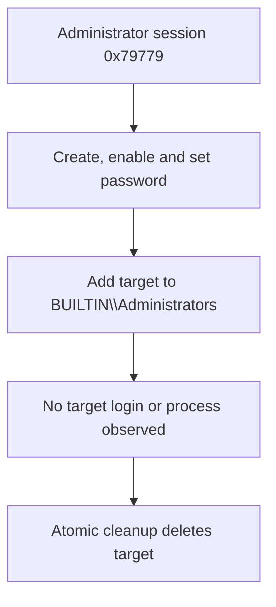

# Scenario 11 — Privileged Account and Group Membership Change

## Overview

This scenario investigates the creation of an account and its addition to a privileged Windows group on a domain controller. The investigation separates the **technical change** from the **business-authorisation decision** and then checks whether the target identity used the newly granted access.

The source is a controlled Splunk Attack Range / Atomic Red Team test. The observed group change is a true positive, while the intent is classified as an authorised security simulation.

## Case summary

| Item | Finding |
| --- | --- |
| Primary host | `win-dc-7216619.attackrange.local` |
| Actor | `ATTACKRANGE\Administrator` |
| Actor session | `0x79779` (decimal `497529`) |
| Target account | `ATTACKRANGE\T1136.001_Admin` |
| Privileged group | `BUILTIN\Administrators` |
| Confirmed change | Account created, enabled, assigned a password, modified, and added to Administrators |
| Target use after change | Not observed in the selected Windows Security and Sysmon telemetry |
| Cleanup | Account deleted approximately three seconds later by cleanup session `0x7FE66` |
| Ticket / approver / approved window | Not available in the dataset |
| Detection disposition | **True Positive — privileged membership change occurred** |
| Business classification | **Legitimate Authorised Change — controlled security test** |

## Confirmed event chain



The records are linked by more than timing: Windows Security uses the same actor `SubjectLogonId`; Sysmon records the same user and Logon ID; the commands contain the exact account and group; account-management events retain the same target identity; and the Atomic test and cleanup commands explain the creation and deletion process chains.

## Key evidence

| Evidence | Purpose |
| --- | --- |
| [`investigation-notes.md`](investigation-notes.md) | Concentrated investigation, field relationships, and negative findings |
| [`triage-note.md`](triage-note.md) | Initial severity, triage decision, escalation logic, and closure state |
| [`investigation-report.md`](investigation-report.md) | Final evidence-backed report and classification |
| [`detection-engineering.md`](detection-engineering.md) | Layered detection strategy, SPL examples, testing, and tuning |
| [`recommended-actions.md`](recommended-actions.md) | Production containment, remediation, recovery, and validation actions |
| [`evidence/processed/privilege-change-timeline.csv`](evidence/processed/privilege-change-timeline.csv) | Ordered Security and Sysmon event chain |
| [`evidence/processed/key-events-sanitized.log`](evidence/processed/key-events-sanitized.log) | Minimal sanitised event excerpts |
| [`evidence/processed/detection-validation.csv`](evidence/processed/detection-validation.csv) | Local validation results for the layered analytics |
| [`detections/windows-privileged-group-membership-addition.yml`](detections/windows-privileged-group-membership-addition.yml) | Portable Sigma detection template |

## Investigation questions answered

1. **Who made the change?** `ATTACKRANGE\Administrator`, using creation session `0x79779`.
2. **What changed?** `ATTACKRANGE\T1136.001_Admin` was created and added to `BUILTIN\Administrators`.
3. **Did the privilege change take effect?** Yes. Event 4732 confirms the membership addition.
4. **Was it authorised?** The Atomic Red Team metadata and decoded command prove controlled-test intent. A production ticket and approval record are not available.
5. **Was the new privilege used?** Not observed. No target 4624/4625, 4648, 4672, or Sysmon process execution was found.
6. **Was persistence left behind?** The account was deleted. No explicit 4733 removal event was observed, but deletion was confirmed by Event 4726 and the cleanup process chain.

## Detection approach

The detection design uses three layers:

1. Alert on additions to defined privileged groups using 4728, 4732, or 4756.
2. Raise confidence when a new account is added to a privileged group on the same host within 15 minutes.
3. Escalate severity if the new member subsequently logs on, receives Event 4672 privileges, uses explicit credentials, or runs processes.

Authorisation data is enrichment, not a substitute for the technical detection. A valid ticket can change the business classification, but it does not make the audited membership change a false positive.

## Reproduce the processed evidence

Place the three source files in `evidence/raw/`, then run:

```bash
python3 scripts/analyze_dataset.py \
  --metadata evidence/raw/atomic_red_team.yml \
  --security evidence/raw/windows-security.log \
  --sysmon evidence/raw/windows-sysmon.log \
  --output-dir evidence/processed
```

Validate the detection layers against the derived timeline:

```bash
python3 scripts/validate_detection.py \
  --timeline evidence/processed/privilege-change-timeline.csv \
  --output evidence/processed/detection-validation.csv
```

The raw files remain local and are excluded by `.gitignore`. Processed command lines replace the static teaching password with `[REDACTED-LAB-PASSWORD]`.

## Scope and limitations

- Windows Security timestamps do not state a time zone; UTC is inferred from exact second-level alignment with Sysmon UTC.
- Immutable numeric target SID, directory Object ID, and distinguished name are not available in the rendered source.
- The actor session has no usable source IP (`-`).
- Ticketing, approval, CMDB, and maintenance-window data are not part of the dataset.
- Sysmon coverage is limited to one host; full cross-host and network follow-on activity cannot be excluded.
- The test ran on a domain controller. `BUILTIN\Administrators` is therefore interpreted in the domain-controller/AD Builtin context, not as an ordinary workstation-local group.

## ATT&CK mapping

| Mapping | Use in this scenario |
| --- | --- |
| [T1098.007 — Additional Local or Domain Groups](https://attack.mitre.org/techniques/T1098/007/) | Primary mapping for the confirmed privileged group membership addition |
| [T1136.001 — Create Account: Local Account](https://attack.mitre.org/techniques/T1136/001/) | Original Atomic test and dataset provenance |
| [T1136.002 — Create Account: Domain Account](https://attack.mitre.org/techniques/T1136/002/) | More precise description of the account semantics visible on the domain controller |

## References

- [Splunk Attack Data — Atomic Red Team T1136.001](https://research.splunk.com/attack_data/cc9b25e2-efc9-11eb-926b-550bf0943fbb/)
- [Microsoft Event 4732 documentation](https://learn.microsoft.com/en-us/previous-versions/windows/it-pro/windows-10/security/threat-protection/auditing/event-4732)
- [Microsoft Defender for Identity — Windows event auditing](https://learn.microsoft.com/en-us/defender-for-identity/deploy/configure-windows-event-collection)
- [MITRE DET0310 — Suspicious Addition to Local or Domain Groups](https://attack.mitre.org/detectionstrategies/DET0310/)
- [Splunk Security Content — Detect New Local Admin Account](https://research.splunk.com/endpoint/b25f6f62-0712-43c1-b203-083231ffd97d/)
