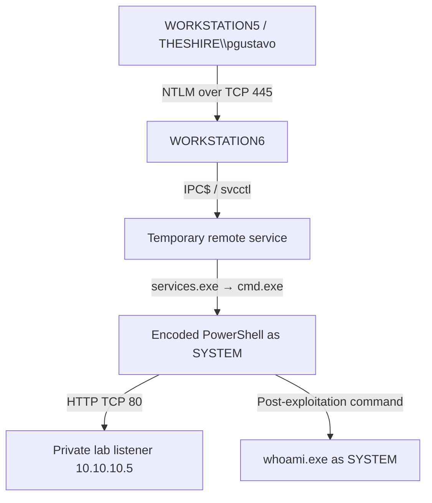

# Scenario 13 — Lateral Movement Through SMB Remote Service Execution

## Executive summary

This investigation reconstructs successful lateral movement from `WORKSTATION5` (`172.18.39.5`) to `WORKSTATION6` (`172.18.39.6`) through SMB2 and the remote Service Control Manager interface. `THESHIRE\pgustavo` completed an NTLM Type 3 network logon, accessed `IPC$\svcctl`, and created temporary service `PGUJLOAKFQFVOMHGFQPX`. The service command produced a `services.exe → cmd.exe → cmd.exe → powershell.exe` process chain on the target, running as `NT AUTHORITY\SYSTEM`. The new PowerShell process connected to the private lab listener at `10.10.10.5:80` and later spawned `whoami.exe` as SYSTEM.

**Verdict:** True Positive
**Severity:** High
**Primary technique:** SMB/Windows Admin Shares (`T1021.002`) with Service Execution (`T1569.002`)
**Scope:** One confirmed source endpoint, one confirmed target endpoint, one domain controller used for credential validation, one domain account, and one private lab listener

## Confirmed attack path



`MORDORDC` validated the credential but is not classified as compromised. The capture proves source-side attack activity on `WORKSTATION5`, but it does not contain the initial-compromise path for that host.

## Key identifiers and correlation keys

| Item | Value | Why it matters |
|---|---|---|
| Source host/IP | `WORKSTATION5` / `172.18.39.5` | Origin of the SMB session |
| Target host/IP | `WORKSTATION6` / `172.18.39.6` | Endpoint where remote execution occurred |
| Account | `THESHIRE\pgustavo` | Account used for the remote logon and service creation |
| Target Logon ID | `0x2074186` | Links 4624, 4672, 5140, 5145 and 4697 |
| SMB flow | `172.18.39.5:50504 → 172.18.39.6:445` | Links endpoint and packet evidence |
| Named pipe | `svcctl` | RPC channel to the Service Control Manager |
| Service | `PGUJLOAKFQFVOMHGFQPX` | Links PCAP, 4697, 7045 and service-registry events |
| Source ProcessGuid | `{b34bc01c-f6f9-5f66-b410-000000000400}` | Source PowerShell associated with the TCP/445 connection |
| Target PowerShell ProcessGuid | `{d273d0f0-fd6c-5f66-7605-000000000800}` | Links process creation, HTTP connection and `whoami.exe` |
| Lab listener | `10.10.10.5:80` | Private simulation endpoint reached by target PowerShell |

## Evidence chain

| Stage | Primary evidence | Independent confirmation |
|---|---|---|
| SMB connection | Sysmon 3 on both endpoints | Both PCAPs show the same TCP/445 flow |
| Authentication | 4624 Type 3, NTLMv2, source `WORKSTATION5` | 4776 success on `MORDORDC`; PCAP NTLMSSP exchange |
| Privileged session | 4672 under Logon ID `0x2074186` | Same Logon ID appears in the service-install event |
| Remote SCM access | 5140 `IPC$` and 5145 `svcctl` | PCAPs show `IPC$`, `svcctl`, SVCCTL bind and SCM operations |
| Service creation | 4697 and 7045 | Sysmon 12/13 registry activity; service name in both PCAPs |
| Remote execution | Sysmon 1 and Security 4688 process chain | PowerShell 4104 exposes the stage-one behaviour |
| Successful target control | Target PowerShell network event to `10.10.10.5:80` | Target PCAP confirms bidirectional HTTP; `whoami.exe` runs as SYSTEM |

## Important analytical boundaries

- **Telemetry-confirmed:** NTLM authentication, SMB/IPC$/`svcctl`, remote service creation, target-side SYSTEM execution and outbound HTTP activity.
- **Simulation-ground-truth only:** the source-side command supplied an NTLM hash to `Invoke-SMBExec`. Target and network telemetry cannot independently distinguish hash use from another successful NTLM credential source.
- **Not available:** change-ticket, deployment, administrator-approval and asset-owner records. Authorization status therefore cannot be independently confirmed from telemetry alone.
- **Not observed:** RDP, WinRM, a WMI-linked remote-execution chain, or movement from `WORKSTATION6` to a third internal target.

Processed evidence excludes the demonstration hash and the full encoded payload.

## Main findings

1. `THESHIRE\pgustavo` completed a Type 3 NTLM network logon on `WORKSTATION6` from `WORKSTATION5`.
2. Logon ID `0x2074186` received special privileges and then accessed `IPC$` and `svcctl`.
3. The same session installed temporary demand-start service `PGUJLOAKFQFVOMHGFQPX`.
4. The service command used `%COMSPEC%`, nested command shells and hidden encoded PowerShell.
5. `services.exe → cmd.exe → cmd.exe → powershell.exe` executed as `NT AUTHORITY\SYSTEM`.
6. PowerShell Event 4104 records attempts to impair Script Block Logging and AMSI, download encrypted data, decrypt it and execute it in memory.
7. The same target PowerShell ProcessGuid connected to `10.10.10.5:80` and later spawned `whoami.exe` as SYSTEM.
8. The SVCCTL `StartServiceW` response reported `WERR_SERVICE_REQUEST_TIMEOUT`; target process telemetry proves that the configured command nevertheless executed successfully.
9. No evidence in this capture shows propagation beyond `WORKSTATION6` or compromise of `MORDORDC`.

## Data and time handling

- Dataset: OTRF Security Datasets — Empire Invoke SMBExec.
- Pinned upstream dataset commit: `d9d40ef123d2c87d5d3df28c96bcab4f0faccc87`.
- Host data: newline-delimited JSON containing Security, System, Sysmon and PowerShell events.
- Network data: endpoint PCAPs from `WORKSTATION5` and `WORKSTATION6`.
- Sysmon `UtcTime` is preferred. Other `EventTime` values are normalised from EDT (`UTC-04:00`) for 20 September 2020.
- Cross-host and collector timestamps differ by up to about two seconds. PCAP timestamps are preferred for packet ordering; Windows correlation relies on identifiers, the network tuple and a narrow time window.

## Repository contents

- `investigation-report.md` — detailed reasoning and final conclusion.
- `investigation-notes.md` — concise evidence-status ledger and correlation notes.
- `triage-note.md` — analyst triage record.
- `dataset-decision-record.md` — selected/rejected dataset rationale.
- `evidence-inventory.md` — source, integrity, publication and evidence-handling inventory.
- `recommended-actions.md` — validation, containment, credential and scoping actions.
- `containment-plan.md` — operational containment and recovery sequence.
- `detection-engineering.md` — detection logic, tuning and telemetry requirements.
- `queries.md` — reproducible hunt and correlation queries.
- `detections/` — Sigma, Splunk and Microsoft Sentinel content.
- `scripts/prepare_dataset.sh` — pinned download, hash verification and safe extraction.
- `scripts/analyze_otrf_smbexec.py` — standard-library parser, assertions and processed-evidence generation.
- `evidence/processed/` — sanitised timelines, scope, process, flow and indicator summaries.

## Reproduce the analysis

Run from the Scenario 13 directory.

```bash
bash scripts/prepare_dataset.sh
```

Purpose: preserve the rejected Splunk candidate, download the pinned OTRF host/network archives, verify the expected SHA-256 values, test the ZIPs and extract the dataset under ignored `evidence/raw/` paths.

```bash
bash scripts/run_analysis.sh
```

Purpose: assert the expected authentication, named-pipe, service, process and network evidence, then regenerate the processed evidence.

```bash
git status --short --untracked-files=all .
```

Purpose: confirm that raw archives, JSON, PCAPs and working files remain excluded while portfolio deliverables are visible to Git.

## References

- [OTRF dataset documentation](https://securitydatasets.com/notebooks/atomic/windows/lateral_movement/SDWIN-190518210125.html)
- [OTRF Security-Datasets repository](https://github.com/OTRF/Security-Datasets)
- [MITRE ATT&CK T1021.002 — SMB/Windows Admin Shares](https://attack.mitre.org/techniques/T1021/002/)
- [MITRE ATT&CK T1569.002 — Service Execution](https://attack.mitre.org/techniques/T1569/002/)
- [Microsoft Event 4624](https://learn.microsoft.com/en-us/previous-versions/windows/it-pro/windows-10/security/threat-protection/auditing/event-4624)
- [Microsoft Event 4697](https://learn.microsoft.com/en-us/previous-versions/windows/it-pro/windows-10/security/threat-protection/auditing/event-4697)
