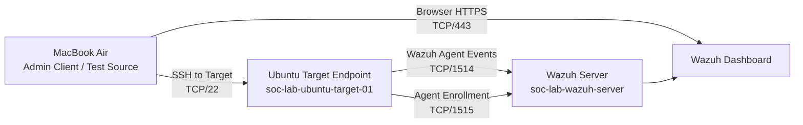

# Lab Architecture

## Purpose

This lab simulates a small enterprise-style Security Operations Center (SOC) monitoring environment. The goal is to practice alert triage, log validation, and incident-style reporting using Wazuh SIEM / XDR and Linux endpoint telemetry.

## Architecture Summary

| Item | Value |
|------|-------|
| Cloud provider | DigitalOcean |
| Region | Sydney SYD1 |
| VPC | default-syd1 |
| Project | first-project |
| Wazuh Server | `soc-lab-wazuh-server` |
| Ubuntu Target | `soc-lab-ubuntu-target-01` |
| Endpoint agent | Wazuh Agent v4.14.5 |

## Network Diagram

## Component Roles

### MacBook Air

- SSH administration client
- Browser access point for Wazuh Dashboard
- Controlled source for authorized SSH authentication tests

### Wazuh Server

Installed components:

- Wazuh Manager
- Wazuh Indexer
- Wazuh Dashboard
- Filebeat

### Ubuntu Target Endpoint

- Monitored Linux endpoint
- Authorized target for controlled SSH authentication tests
- Source of `/var/log/auth.log` telemetry

## Agent Communication

| Flow | Purpose |
|------|---------|
| Target `10.126.0.3` → Wazuh Server `10.126.0.2`, TCP/1514 | Agent event forwarding |
| Target `10.126.0.3` → Wazuh Server `10.126.0.2`, TCP/1515 | Agent enrollment |

## Firewall Design

| Port | Purpose | Recommended Exposure |
|------|---------|----------------------|
| TCP/22 | SSH administration | Trusted admin IPs only |
| TCP/443 | Wazuh Dashboard | Trusted admin IPs only |
| TCP/55000 | Wazuh API | Trusted admin IPs only |
| TCP/1514 | Agent event forwarding | Ubuntu Target private IP only |
| TCP/1515 | Agent enrollment | Ubuntu Target private IP only |
